# GlassBox XAI: Attention U-Net for Medical Image Segmentation with Explainability

**GlassBox** is a deep learning computer vision system designed to support medical professionals by providing automated medical image segmentation. It achieves high performance (Dice: O.875, IoU: 0.8) on the **ISIC 2018 - Task 1: Binary Segmentation** skin lesion dataset.

Beyond performance, **explainable AI (XAI)** techniques reveal model reasoning for enhanced **transparency**, **reliability**, and **auditability**. XAI techniques featured include **saliency heatmap overlays**, **pixel confidence overlays**, **integrated gradient overlays**, and **end-to-end layer-wise Grad-CAM**. Inference is constructed with **transparency**, enabling effective **human-in-the-loop (HITL)** workflows and supporting **clinical review**.

Model-agnostic pipelines are structured for **model retraining** and **CI/CD**, with all functionality **fully interoperable** across all model variants. GlassBox is a **scalable foundation for responsible AI deployment** in regulated, high-stakes environments. **Model architecture**, **pipelines** (preprocessing, augmentation, training, evaluation), and **explainability** are designed for reusability across diverse segmentation tasks. Potential expanded clinical applications include **chest X-rays**, **retinal scans**, or **thoracic CT**, with **minimal adaptation**.

This prototype reflects the capabilities achievable through independent development; **real-world deployment would require collaboration with clinical and regulatory experts**.

> Author’s note: The following work reflects independent development by an AI engineer trained in healthcare AI. This project is a research prototype, not a medical device. All reported metrics relate to performance on the provided test set, not clinical applications.

---

## Data Ethics & Full Disclaimer

**This project is for research and demonstration purposes only. It is not a medical device and is not intended for clinical use, diagnosis, or treatment.**

**All medical images shown are sourced from the ISIC 2018 Challenge Dataset. A publicly released, fully anonymized dataset curated for non-commercial research. No private health information (PHI) is included.**

**All results and visual outputs are generated by deep learning models and evaluated using the official ISIC 2018 test set for accuracy metrics. This work has not been validated in clinical settings.**

**No claims are made regarding diagnostic accuracy, safety, or suitability for clinical deployment or decision support.**

**Visualizations (e.g., segmentation masks, XAI overlays, etc.) are interpretability tools designed to support human understanding of model behavior. They are not clinical indicators.**

> This work reflects a commitment to transparency, explainability, and responsible AI development in medical imaging and general XAI research. Please refer to the [ISIC 2018 dataset license and terms of use](https://challenge2018.isic-archive.com/) for attribution and usage guidelines.

---

## System Overview

- **High Performance Benchmarks:** Dice: O.875, IoU: 0.8. These metrics reflect how closely the models' segmentation boundaries align with the expert ground truth segmentation boundaries. All three models are 100% accurate at detecting every lesion in the test set of 1000 images. 
- **Custom architecture:** U-Net with attention bottleneck.
- **Model Variants** include precision-optimized (reduced false positives), recall-optimized (reduced false negatives), and balanced.
- **Dataset**: ISIC 2018 – Task 1: Binary Segmentation, with established training, validation, and test partitions preserved for precise benchmarks.  
- **Custom Loss functions**: Dice, Tversky, Hybrid.
- **Training Pipeline** includes robust augmentation, fine tuning, and callbacks for early stopping, iterative checkpoints, and LR scheduling. 
- **Model-agnostic** utilities for evaluation, batch metrics, confusion matrices, comparison, and explainability.
- **Fully modular** XAI + evaluation pipeline supports any model, batch, or layer combination.
- **Plug-and-play** functions for metric reporting, model variant comparison, and visual overlays.
- **Modular** image processing stack supports image/mask alignment, augmentation, and pre-inference transformations.
- **LLM Integration** for accurate and efficient batch metric retrieval using lightweight tinyllama 1.1B.

- **Additional Constraints Imposed:** Developed for low-infrastructure (rural) deployment. Full training, augmentation, evaluation, segmentation, XAI techniques, and LLM integration run on **modest hardware**.
- No data outside of ISIC 2018.
- No pretrained models.
- No compute-heavy ViTs or ensembles.
- No cloud dependency.
- No GPU required. CPU-optimized. 

---

## Transparency, Auditability & HITL Design

GlassBox addresses the challenge of **interpretable segmentation** in high-stakes domains using skin lesion analysis as a case study. Accurate **binary segmentation** is a foundational task in medical image analysis.

While black-box models can achieve high performance, they often lack **transparency**, **auditability**, and **alignment** with expert workflows. This gap makes them **unsuitable** for deployment in safety-critical settings. GlassBox explores how **explainable AI (XAI)** methods can be integrated directly into the segmentation pipeline.

- Full Layerwise Grad-CAM, Integrated Gradient Overlays, Saliency Overlays, Pixel Confidence Overlays
- Variant model comparative segmentation, confusion matrices, and metrics
- Outputs and heatmap overlays designed for **review, regulatory compliance, and clinical workflow integration**  
- Transparency layers directly support **human-in-the-loop (HITL)** processes

Studies show interpretable tools are more likely to gain clinician trust for integration into expert workflows [(Holzinger et al., 2017)](https://arxiv.org/abs/1712.09923).

This project does not address diagnosis. Its focus is bridging the gap between high-performing black-box segmentation models and **interpretable**, **auditable systems** that can support **responsible deployment**.

---

## Generalizability

System structure, transparency methods, and audit frameworks generalize to:

- Additional Medical Imaging Tasks
- Agriculture Automation 
- Quality Control Processes
- Satellite Imagery Segmentation

---

## Metrics 

Previously, F1 Score and Dice diverged due to calculating global pixel averages vs. global image batch averages. The calculation formulas were later unified. Both Dice and F1 have been kept for completeness.

| Model              | Dice     | IoU      | Precision | Recall   | F1 Score | Pixel Accuracy |
|-------------------|----------|----------|-----------|----------|----------------|----------|
| **Precision-Optimized**   | **0.8751** | **0.8000** | **0.8870**  | 0.9052   | **0.8751**     | **0.9272**   |
| **Balance-Optimized**| 0.8735   | 0.7925   | 0.8624    | 0.9228   | 0.8735         | 0.9267 |
| **Recall-Optimized** | 0.8573   | 0.7669   | 0.8149    | **0.9444** | 0.8573         | 0.9182   |

View Test Set Evaluation Metrics

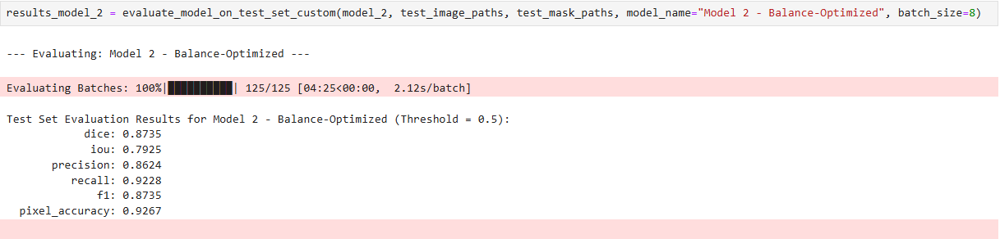

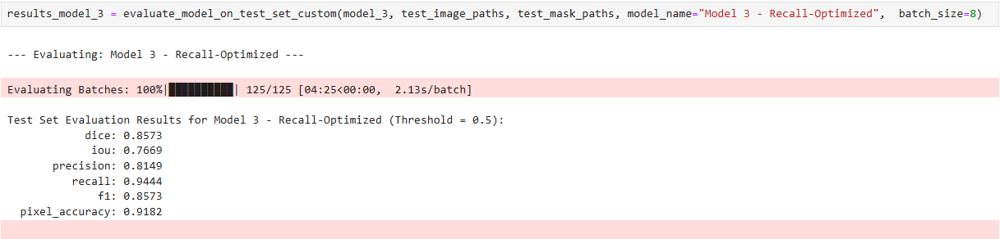

---

## Pixel-Level Error

**False positive (FP) and false negative (FN) rates are derived from confusion matrices and represent the percentage of total test set pixels. These values align with reported pixel accuracy.**

| Model                     | False Positives (%) | False Negatives (%) |
|---------------------------|---------------------|----------------------|
| **Precision-Optimized**            | ~2.5%               | ~4.8%                |
| **Balance-Optimized**         | ~3.3%               | ~4.0%                |
| **Recall-Optimized**          | ~5.2%               | ~3.0%                |

View Confusion Matrices

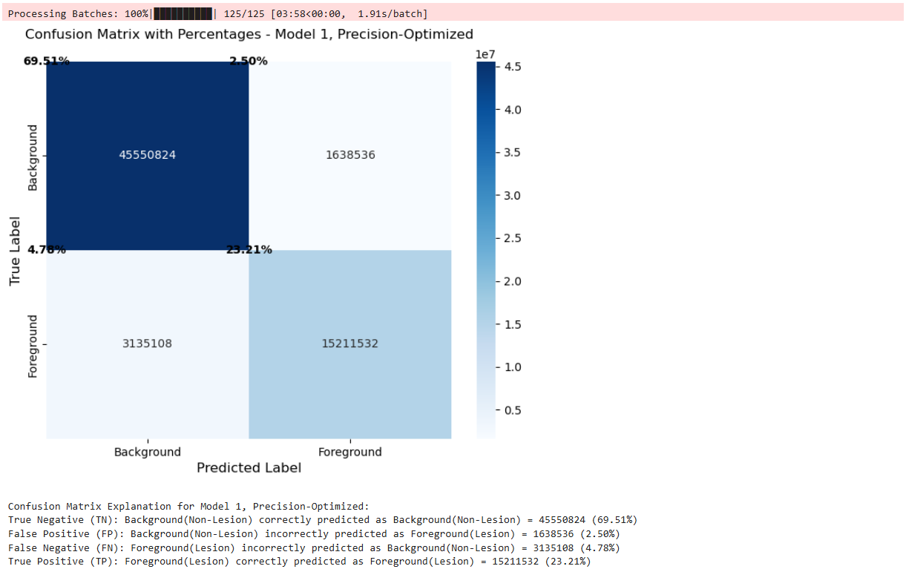

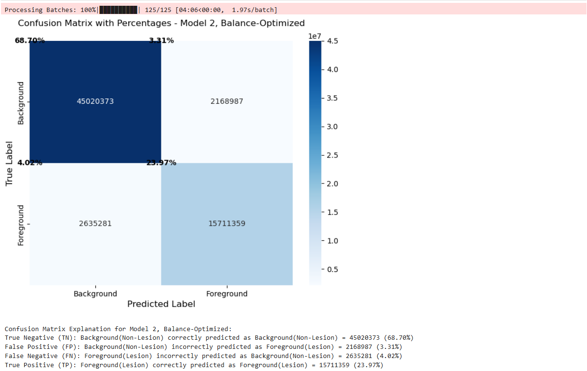

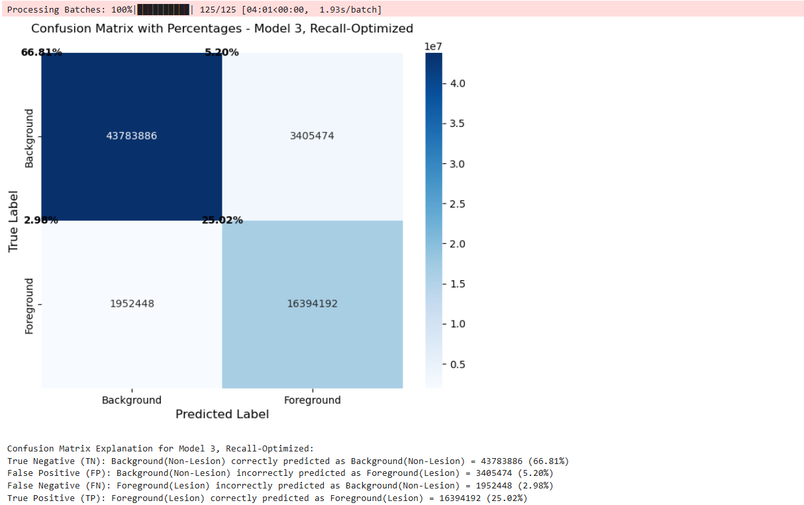

---

## Model Mask Output vs. Ground Truth Mask

**A single batch featuring mean performance, batch 78, is displayed across all visuals for transparency. This batch's performance metrics closely match Model 1's performance on the full 1000 image test set (Dice 0.875, IoU 0.8).** 

**All functions are fully modular and can be passed any model, batch, or layer.** 

**All outputs generated and recorded at time of inference.**

Basic mask output for batch 78 using Model 1 (Precision-Optimized) to illustrate how overlays are constructed, step by step, from model output.

*Side-by-side comparison of model mask output vs. ground truth masks.*

Basic Mask Output

---

## Segmentation Overlay vs Ground Truth Overlay

Segmentation Overlay for Model 1 (Precision-Optimized). The model's mask output has been dimmed and laid over the original image.

*Side-by-side comparison of model-produced segmentation overlay vs. ground truth overlay.*

Basic Mask Output

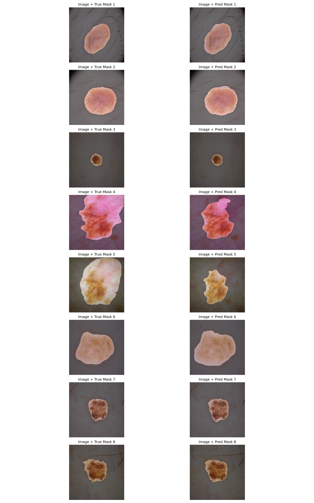

---

## Segmentation Overlay Comparison of Variant Models vs Ground Truth Overlay with Batch Metrics

Three model variants trained via different loss functions for specialized error profiles, compared. 

*Side-by-side comparison of segmentation output vs. ground truth across three model variants.*

View Comparative Model Outputs

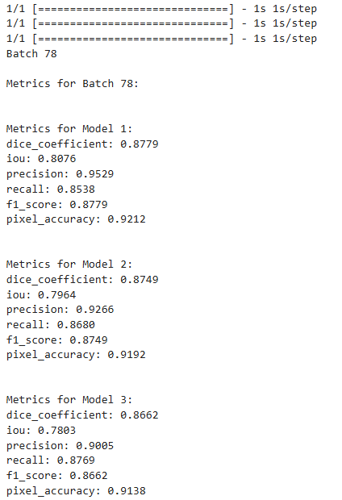

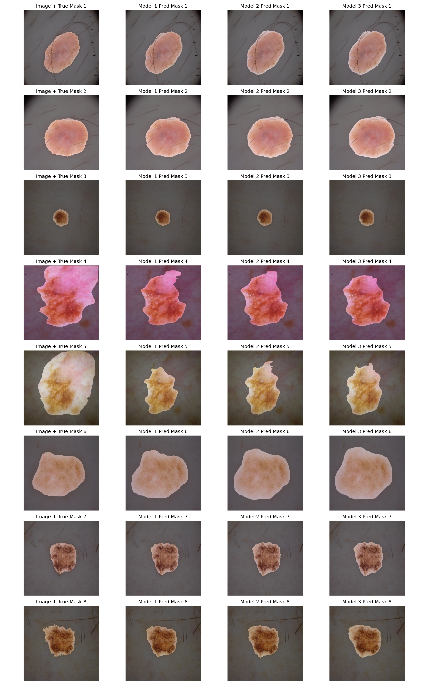

---

## LLM Integration for Batch Metric Retrieval

Accurate and efficient batch metric retrieval using JSON structured data and Tinyllama 1.1B. Retrieved metrics match calculated and saved metrics for each batch.

View LLM Integration for Batch Metric Retrieval

### Model 1 Batch Metric Data for Comparison
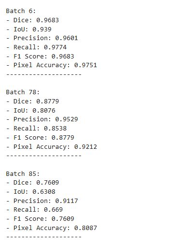

### Model 1 Batch Metric LLM Retrieval
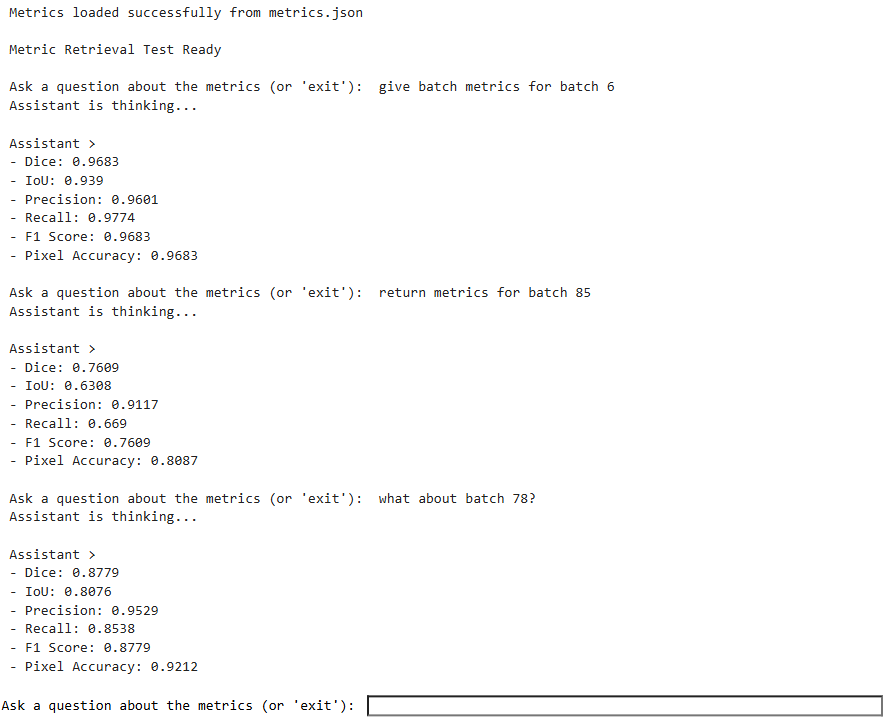

---

## Superpixel Confidence Mapping for XAI

Pixel-level confidence for model's segmentation decisions. Superpixels are formed by averaging like pixels via SLIC algorithm. 200 superpixel segments (configurable parameter) applied for visualization.

*Heatmap displaying class confidence for each pixel, grouped by like pixels, for transparency.*

View Pixel Confidence Mapping

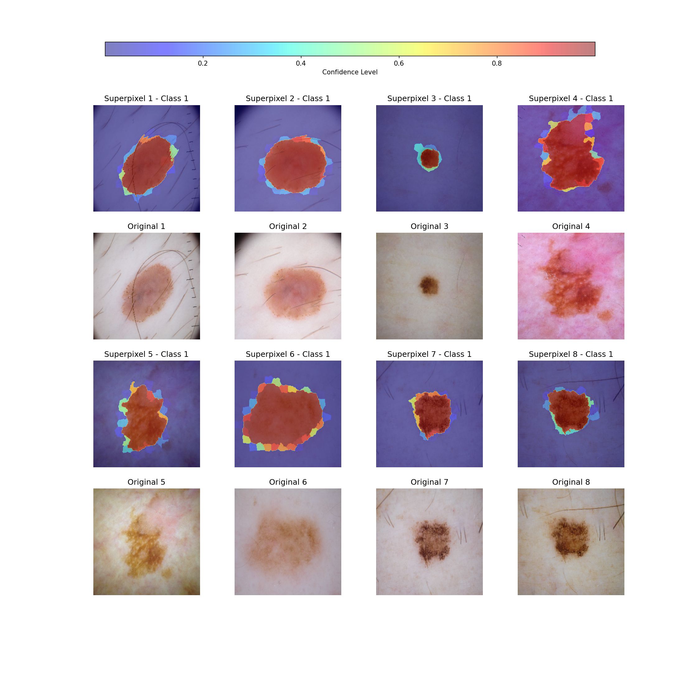

---

## Layer-wise Grad-CAM for Decoder Layers for XAI

Visualization of decoder layers only. Any layer or layer grouping can be visualized with this technique (configurable parameter), but encoder, bottleneck, and output layer not shown here. Smoothing (configurable parameter) applied for visualization.

*Heatmap of contribution to output across layers for transparency.*

View Layer-wise Grad-CAM for Decoder Layers

---

## Saliency Mapping for XAI

Basic saliency mapping shows model sensitivity without regard to attribution. Scaling factor (configurable parameter) of 10 applied for visualization.

*Saliency heatmap overlay for transparency.*

View Basic Saliency Mapping

---

## Saliency Mapping with Smooth Grad for XAI

Saliency mapping averaging 50 samples (configurable parameter) for more robust visualization. Scaling factor of 10 applied for visualization. 

*Saliency heatmap overlay, with smooth grad applied, for transparency.*

View Saliency Mapping with Smooth Grad

---

## Saliency Mapping with Guided Backpropagation for XAI

Saliency mapping with guided backpropagation. Scaling factor of 10 applied for visualization. 

*Saliency heatmap overlay, with guided backpropagation, for transparency.*

View Saliency Mapping with Guided Backprapogation

---

## Integrated Gradient Mapping for XAI

Integrated gradient mapping for attribution. Parameters applied for visualization: scaling factor of 1, 50 steps, tf.zeros_like baseline. All parameters are configurable.

*Heatmap of gradient attribution for transparency.*

View Integrated Gradient Mapping

---

## Key Development Milestones

These milestones reflect not only technical development but iterative experimentation, systematic validation, and a focus on real-world explainability.

---

### Problem Scoping & Constraints
- Defined potential clinical context, performance requirements, and XAI capabilities.
- Chose to exclude pretrained models and external datasets to enforce full transparency and auditability.
- Prioritized Dice as the most clinically relevant metric.

---

### Data Review & Integrity
- Selected ISIC 2018 Challenge: Task 1 dataset for its clinical relevance and benchmark status.
- Maintained original training, validation, and test splits for reproducibility and fair comparison.

---

### Model Architecture Design
- Designed and initialized a custom U-Net model with attention mechanisms.
- Incorporated layer normalization, dropout, and other regularization strategies to reduce overfitting.

---

### Modular Augmentation Pipeline
- Developed a modular image processing pipeline supporting toggled transformations.
- Solved and validated image-mask alignment through shared random seeds and post-transform verification.
- Experimentation with transformations.

---

### Custom Loss Functions
- Implemented and compared Dice Loss, Tversky Loss, and a hybrid Dice–Tversky Loss to optimize for various clinical priorities.
- Aligned loss strategies with model variants.

---

### Initial Training
- Conducted initial training runs with aggressive logging, callbacks, and visualization.
- Verified base model performance using validation metrics prior to variant model fine-tuning.

---

### Variant Fine-Tuning
- Refined training parameters and loss functions for three model variants: Dice-Optimized, Balanced (F1), Recall-Optimized
- Tracked validation metrics to detect overfitting and guide early stopping.

---

### Evaluation & Benchmarking
- Computed all relevant performance metrics (Dice, IoU, Precision, Recall, Pixel Accuracy, F1 Score).
- Compared results across all three model variants.
- Used unaltered test set, no image preprocessing, for final benchmark reporting.

---

### Visualization & Verification
- Overlaid predicted segmentation masks on source images for visual inspection.
- Used this to detect potential post-processing errors.

---

### Preprocessing Experimentation
- Tested multiple preprocessing configurations and evaluated their impact on final test performance.
- Chose to report metrics without preprocessing to preserve direct comparability with other ISIC benchmark solutions.

---

### Explainability (XAI) Tools
- Solved the issue of model cloning and output layer adjustment for pre-sigmoid raw logit access.
- Added overlays and side-by-side views to improve interpretability.
- Tuned XAI tools to operate on either tensor or NumPy representations depending on compatibility.
- Implemented Grad-CAM, superpixel confidence mapping, saliency mapping, integrated gradients, and Grad-CAM layer visualizations.

---

### End to End Layer Visualization
- Created a function to visualize any layer, or combination of layers, using Grad-CAM.
- Enabled full layer-level inspection to observe architecture and confirm attention application.

### LLM Integration
- Integrated Tinyllama 1.1B, an efficient LLM, for querying and retrieving recorded batch metrics.
- Tested functionality and iterated on scaffolding, parsing, prompt engineering, and LLM configuration until 100% test accuracy achieved.

---

## Future Work

GlassBox has several avenues for improving model performance with tradeoffs in interpretability, development time, on-device feasibility, and computational cost. 

---

### Subject Matter Expert Collaboration
For GlassBox to transition from proof-of-concept to clinical utility, collaboration with dermatology experts is essential.

- **Clinical Workflow Integration**
Partnering with dermatologists and clinical advisors can help validate the utility of XAI techniques in clinical settings, identify opportunities for workflow integration, and prioritize additional techniques for decision support.

- **UI/UX Development**
Building user interfaces tailored to clinical or educational use could improve usability for XAI visualizations. Integrating GlassBox with clinical tools and EHR systems could further enhance its utility in real-world workflows.

- **Expanded XAI & Human-in-the-Loop (HITL) Tools**
Designing additional tools that allow experts to explore model reasoning, suggest corrections, and highlight edge cases could improve trust, enable targeted retraining, and accelerate model refinement through human-in-the-loop feedback.

---

### Performance Improvement
Improving Dice performance from 0.875 to 0.9 is feasible if we expand training data beyond the relatively small ISIC 2018 set and optimize data augmentation during training. 

Improvement beyond this is achievable as well, but would require more time and computational complexity. For example, an ensemble combining a high-performing Attention U-Net with architecturally diverse models could match the performance of 2025 state-of-the-art solutions.

- **Optimize Data Augmentation**
More advanced or domain-specific augmentation strategies could improve generalization. This would require more experimentation and domain expert collaboration.

- **Expand Training Data**
Incorporating more expert-annotated images from trusted sources (e.g., HAM10000) could improve model performance and reduce bias. This would be the most efficient way to improve metrics, and would have been prioritized in this iteration, but we constrained ourselves to using only the unaltered ISIC 2018 dataset for training.

- **Ensemble Models**
Combining the strengths of multiple models via ensembling or model averaging could improve overall performance, but increases inference time and complexity. While ensembling the three variant models in GlassBox is technically possible, their shared architecture limits the diversity of learned representations, likely resulting in minimal gains. Greater benefits would be expected from ensembling architecturally diverse models.

- **Vision Transformers**
Transformer-based architectures have shown state-of-the-art performance in medical imaging tasks. Exploring these could improve segmentation performance. However, they generally require large-scale training data and increased computational complexity.

- **Pre-Trained Models**
Using pretrained encoders or models may accelerate convergence and improve performance, though it may reduce transparency and regulatory compliance if training data is not fully auditable. Additionally, most pretrained models require licensing agreements for full production deployment.

---

## Connect & Contact

Available for live walkthroughs, Q&A, and technical deep dives on this project.

**Jeffrey Robert Lynch** [LinkedIn](https://www.linkedin.com/in/jeffrey-lynch-350930348)

(Demo access, source code discussions, and use-case exploration available upon request.)

> This project is a research-oriented prototype for educational and exploratory purposes only. It is **not a certified medical device**, and I am **not a licensed medical professional**. No part of this work should be used for clinical decision-making without expert validation and regulatory approval.

## Citations

This project uses data from the ISIC 2018: Task 1 – Lesion Segmentation challenge. All images and masks are publicly available, de-identified, and used here under the ISIC data use policy for research and educational purposes.

---

### Dataset & Benchmark Challenges
[1] Noel Codella, Veronica Rotemberg, Philipp Tschandl, M. Emre Celebi, Stephen Dusza, David Gutman, Brian Helba, Aadi Kalloo, Konstantinos Liopyris, Michael Marchetti, Harald Kittler, Allan Halpern: "Skin Lesion Analysis Toward Melanoma Detection 2018: A Challenge Hosted by the International Skin Imaging Collaboration (ISIC)", 2018; https://arxiv.org/abs/1902.03368

[2] Tschandl, P., Rosendahl, C. & Kittler, H. The HAM10000 dataset, a large collection of multi-source dermatoscopic images of common pigmented skin lesions. Sci. Data 5, 180161 doi:10.1038/sdata.2018.161 (2018).

---

### Architecture & Model Design
[3] Ronneberger, O., Fischer, P., & Brox, T. (2015). U-Net: Convolutional Networks for Biomedical Image Segmentation.
https://arxiv.org/abs/1505.04597

[4] Oktay, O., et al. (2018). Attention U-Net: Learning Where to Look for the Pancreas.
https://arxiv.org/abs/1804.03999

---

### XAI & Integration
[5] Holzinger, A., et al. (2017). What do we need to build explainable AI systems for the medical domain?
https://arxiv.org/abs/1712.09923

[6] Tjoa, E., & Guan, C. (2021). A Survey on Explainable Artificial Intelligence (XAI): Toward Medical XAI. IEEE Transactions on Neural Networks and Learning Systems.
https://doi.org/10.1109/TNNLS.2020.3027314

[7] Rudin, C. (2019). Stop explaining black box machine learning models for high stakes decisions and use interpretable models instead. Nature Machine Intelligence.
https://doi.org/10.1038/s42256-019-0048-x

[8] Samek, W., Wiegand, T., & Müller, K.-R. (2017). Explainable Artificial Intelligence: Understanding, Visualizing and Interpreting Deep Learning Models.
https://arxiv.org/abs/1708.08296

---

### Segmentation Metrics
[9] Sudre, C. H., Li, W., Vercauteren, T., Ourselin, S., & Jorge Cardoso, M. (2017). Generalised Dice overlap as a deep learning loss function for highly unbalanced segmentations.
https://arxiv.org/abs/1707.03237

[10] Salehi, S. S. M., Erdogmus, D., & Gholipour, A. (2017). Tversky Loss Function for Image Segmentation Using 3D Fully Convolutional Deep Networks.
https://arxiv.org/abs/1706.05721
